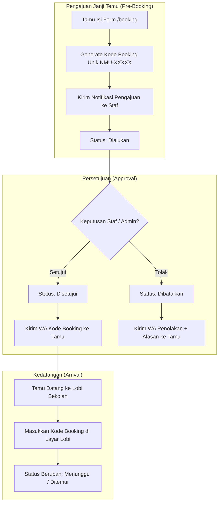

# NamuIn — Digital Receptionist & Guestbook System

**NamuIn** adalah aplikasi buku tamu digital dan manajemen kunjungan sekolah berbasis web. Aplikasi ini dirancang untuk mempermudah tugas resepsionis, merekam kunjungan tamu secara real-time, dan mengintegrasikan notifikasi dua arah secara langsung antara tamu dan staf sekolah melalui WhatsApp API (Fonnte).

---

## 🚀 Fitur Utama

1. **Check-in Tamu Mandiri**: Tamu mengisi data kunjungan (nama, instansi, kategori, tujuan, dan staf yang ingin ditemui) secara langsung lewat layar tablet lobi.
2. **Pre-Booking & Janji Temu**: Tamu dapat menjadwalkan kunjungan terlebih dahulu melalui halaman `/booking`. Sistem akan menghasilkan kode booking unik (`NMU-XXXXX`) dan mengirimkan notifikasi persetujuan ke WhatsApp staf terkait.
3. **Check-in Instan dengan Kode Booking**: Tamu yang sudah membuat janji temu cukup memasukkan kode booking mereka di lobi untuk check-in instan tanpa perlu mengisi ulang data formulir.
4. **Notifikasi WhatsApp Dua Arah (Fonnte API)**:
   * **Staf** menerima notifikasi instan ketika tamu tiba.
   * **Staf** dapat membalas chat WA tersebut langsung dengan mengetik angka `1` (Temui), `2` (Tunda/Tunggu), atau `3` (Sibuk) untuk merespon tamu secara real-time.
   * **Tamu** menerima pesan konfirmasi di WhatsApp mereka beserta tautan untuk melakukan check-out mandiri.
5. **Dashboard Administrasi Premium**:
   * Statistik ringkas (Bento style) untuk memantau tamu hari ini.
   * Pengelolaan data Staf Sekolah, Kategori Tamu, dan Akun Pengguna (Admin & Resepsionis).
   * Panel verifikasi/persetujuan pengajuan janji temu (Pre-Booking).
   * **Simulator WA**: Panel pengujian webhook Fonnte secara offline tanpa memotong kredit token.
   * **Laporan Kunjungan**: Filter laporan laporan lanjutan dan ekspor dokumen ke PDF & Excel.

---

## 🛠️ Stack Teknologi

* **Backend Framework**: [Laravel 11](https://laravel.com) (PHP 8.2+)
* **Database**: MySQL / MariaDB
* **Desain UI/UX**: Vanilla CSS dengan modern design tokens (Frosted Glass, HSL dynamic colors, Modern Typography 'Bricolage Grotesque' & 'Plus Jakarta Sans')
* **Integrasi WA API**: [Fonnte Gateway](https://fonnte.com) (API Kirim Pesan & Webhook Balasan Tamu)
* **Ekspor Laporan**: `Maatwebsite/Laravel-Excel` & `Barryvdh/Laravel-DomPDF`

---

## 📊 Flowchart Sistem (Mermaid Diagrams)

### 1. Alur Kunjungan Tamu Lobi (Check-in & Check-out)
Diagram ini menjelaskan alur ketika tamu datang langsung ke lobi sekolah untuk check-in hingga keluar (check-out):

```mermaid
graph TD
    %% Lobby Guest Flow
    subgraph lobi ["Lobi Tamu (Check-in)"]
        A[Tamu Tiba di Sekolah] --> B{Punya Kode Booking?}
        B -- Ya --> C[Masukkan Kode Booking di Layar]
        C --> D[Status: Sedang Ditemui / Menunggu]
        B -- Tidak --> E[Isi Form Check-in Lobi]
        E --> F[Pilih Kategori & Staf Tujuan]
        F --> G[Sistem Kirim Notifikasi WA ke Staf]
        G --> H[Status: Menunggu]
    end

    %% Webhook & Response Flow
    subgraph respon ["Respon Staf (WhatsApp / Webhook)"]
        H --> I{Staf Membalas via WA?}
        I -- "1 (Temui)" --> J[Status: Sedang Ditemui]
        I -- "2 (Tunda)" --> K[Status: Menunggu (Minta Tamu Tunggu)]
        I -- "3 (Sibuk)" --> L[Status: Selesai / Batal]
        
        J --> M[Kirim Link Check-out ke WA Tamu]
        K --> N[Kirim Pesan Menunggu ke WA Tamu]
        L --> O[Kirim Pesan Penolakan ke WA Tamu]
    end

    %% Checkout Flow
    subgraph checkout ["Check-out"]
        M --> P[Tamu Selesai Kunjungan]
        P --> Q{Metode Check-out?}
        Q -- Mandiri --> R[Klik Link WA dari HP Tamu]
        Q -- Manual --> S[Check-out via Resepsionis Desk]
        R --> T[Status: Selesai + Jam Pulang Tercatat]
        S --> T
    end
```

---

### 2. Alur Pengajuan Janji Temu (Pre-Booking)
Diagram ini menjelaskan alur pengajuan jadwal temu sebelum hari kunjungan:



---

## 🗄️ Kamus Data / Data Dictionary (Struktur Database)

Berikut adalah struktur tabel basis data yang digunakan dalam sistem **NamuIn**:

### 1. Tabel `users`
Menyimpan kredensial akun pengguna sistem (Admin & Resepsionis).
| Nama Kolom | Tipe Data | Keterangan |
| :--- | :--- | :--- |
| `id` | BIGINT (unsigned) | Primary Key, Auto Increment |
| `name` | VARCHAR(255) | Nama lengkap pengguna |
| `email` | VARCHAR(255) | Email pengguna (Unique, untuk login) |
| `password` | VARCHAR(255) | Password terenkripsi (hash) |
| `role` | ENUM('admin', 'receptionist') | Peran dalam sistem (Default: `receptionist`) |
| `remember_token` | VARCHAR(100) | Token remember me untuk otentikasi sesi |
| `created_at` | TIMESTAMP | Waktu pembuatan akun |
| `updated_at` | TIMESTAMP | Waktu pembaharuan terakhir akun |

### 2. Tabel `pegawai`
Menyimpan data staf sekolah (pegawai) yang dapat ditemui oleh tamu.
| Nama Kolom | Tipe Data | Keterangan |
| :--- | :--- | :--- |
| `id` | BIGINT (unsigned) | Primary Key, Auto Increment |
| `nama` | VARCHAR(150) | Nama lengkap staf/pegawai |
| `nip` | VARCHAR(50) | Nomor Induk Pegawai (Nullable, Unique) |
| `jabatan` | VARCHAR(100) | Jabatan staf (contoh: Guru BK, Wakasek) |
| `departemen` | VARCHAR(100) | Departemen (contoh: Kurikulum, Kesiswaan) |
| `no_wa` | VARCHAR(20) | Nomor WhatsApp staf untuk pengiriman notifikasi |
| `email` | VARCHAR(150) | Alamat email staf |
| `aktif` | BOOLEAN | Status keaktifan staf (Default: `true`) |
| `created_at` | TIMESTAMP | Waktu pembuatan data |
| `updated_at` | TIMESTAMP | Waktu pembaharuan terakhir |

### 3. Tabel `kategori_tamu`
Menyimpan kategori asal tamu sekolah.
| Nama Kolom | Tipe Data | Keterangan |
| :--- | :--- | :--- |
| `id` | BIGINT (unsigned) | Primary Key, Auto Increment |
| `nama_kategori` | VARCHAR(50) | Nama kategori (contoh: Orang Tua Wali, Dinas, Sales) |
| `deskripsi` | VARCHAR(255) | Keterangan singkat mengenai kategori (Nullable) |
| `created_at` | TIMESTAMP | Waktu pembuatan data |
| `updated_at` | TIMESTAMP | Waktu pembaharuan terakhir |

### 4. Tabel `tamu`
Menyimpan riwayat dan data kunjungan tamu di lobi.
| Nama Kolom | Tipe Data | Keterangan |
| :--- | :--- | :--- |
| `id` | BIGINT (unsigned) | Primary Key, Auto Increment |
| `nama_tamu` | VARCHAR(150) | Nama lengkap tamu |
| `instansi` | VARCHAR(100) | Nama instansi asal tamu |
| `no_wa` | VARCHAR(20) | Nomor WhatsApp tamu (untuk link check-out mandiri) |
| `kategori_id` | BIGINT (unsigned) | Foreign Key, terhubung ke `kategori_tamu.id` |
| `tujuan_kunjungan`| VARCHAR(150) | Hal yang ingin dicapai dalam kunjungan |
| `bertemu_dengan` | BIGINT (unsigned) | Foreign Key (Nullable), terhubung ke `pegawai.id` |
| `detail_keperluan`| TEXT | Penjelasan detail keperluan (Nullable) |
| `sudah_janji` | BOOLEAN | Menandakan apakah tamu sudah janjian sebelumnya |
| `status` | ENUM('Menunggu', 'Sedang Ditemui', 'Selesai') | Status kunjungan (Default: `Menunggu`) |
| `jam_masuk` | TIMESTAMP | Waktu check-in tamu (Default: `CURRENT_TIMESTAMP`) |
| `jam_pulang` | TIMESTAMP | Waktu check-out tamu (Nullable) |
| `wa_sent_at` | TIMESTAMP | Waktu pengiriman notifikasi awal ke WA Staf (Nullable) |
| `handled_by` | BIGINT (unsigned) | Foreign Key (Nullable), akun admin/resepsionis yang melayani |
| `created_at` | TIMESTAMP | Waktu pembuatan data |
| `updated_at` | TIMESTAMP | Waktu pembaharuan terakhir |

### 5. Tabel `bookings`
Menyimpan data janji temu yang dijadwalkan oleh tamu (Pre-Booking).
| Nama Kolom | Tipe Data | Keterangan |
| :--- | :--- | :--- |
| `id` | BIGINT (unsigned) | Primary Key, Auto Increment |
| `booking_code` | VARCHAR(20) | Kode booking unik tamu (Unique, contoh: `NMU-HQY9D`) |
| `nama_tamu` | VARCHAR(150) | Nama lengkap tamu |
| `instansi` | VARCHAR(100) | Nama instansi asal tamu |
| `no_wa` | VARCHAR(20) | Nomor WhatsApp tamu untuk penerimaan kode booking |
| `kategori_id` | BIGINT (unsigned) | Foreign Key, terhubung ke `kategori_tamu.id` |
| `tujuan_kunjungan`| VARCHAR(150) | Tujuan janji temu |
| `bertemu_dengan` | BIGINT (unsigned) | Foreign Key, terhubung ke `pegawai.id` |
| `detail_keperluan`| TEXT | Penjelasan detail keperluan (Nullable) |
| `tanggal_booking` | DATE | Tanggal janji temu dijadwalkan |
| `jam_booking` | VARCHAR(10) | Jam janji temu dijadwalkan (contoh: `10:00`) |
| `status` | ENUM('Diajukan', 'Disetujui', 'Dibatalkan', 'Checkin') | Status persetujuan janji temu (Default: `Diajukan`) |
| `catatan_staf` | TEXT | Alasan penolakan / pesan tambahan dari staf (Nullable) |
| `created_at` | TIMESTAMP | Waktu pengajuan pre-booking |
| `updated_at` | TIMESTAMP | Waktu pembaharuan status terakhir |

---

## 🛠️ Panduan Instalasi Lokal

1. **Clone Proyek & Masuk ke Direktori**:
   ```bash
   git clone <repository_url> NamuIn
   cd NamuIn
   ```
2. **Install Dependensi Composer**:
   ```bash
   composer install
   ```
3. **Salin & Atur File `.env`**:
   Salin `.env.example` ke `.env` lalu sesuaikan kredensial databasemu:
   ```bash
   cp .env.example .env
   ```
4. **Generate Application Key**:
   ```bash
   php artisan key:generate
   ```
5. **Jalankan Database Migration & Seed**:
   ```bash
   php artisan migrate --seed
   ```
6. **Setting Notifikasi WhatsApp (Fonnte)**:
   Buka file `.env`, lalu konfigurasikan token perangkat Fonnte-mu:
   ```env
   FONNTE_TOKEN=isi_dengan_token_fonnte_anda
   WA_NOTIFICATIONS=true
   ```
7. **Jalankan Aplikasi dengan Laragon**:
   Cukup letakkan folder proyek ini di dalam direktori `laragon/www/NamuIn`, lalu nyalakan Apache & MySQL. Aplikasi akan langsung terakses lokal lewat **`http://namuin.test`**!

---

*developed by some peeps in XI RPL 1*
